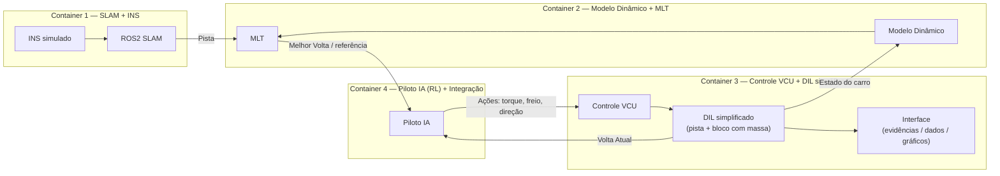
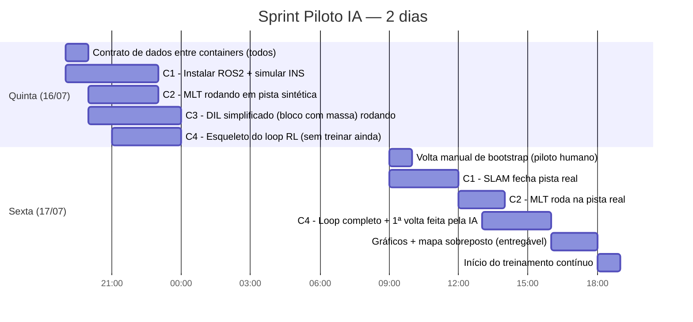

# Sprint Piloto IA — Checklist Operacional

- **Arquitetura em containers.** Todo o sistema vira 4 containers isolados (seção 1.2), o que muda como as frentes são organizadas e adiciona uma frente nova de infra/integração entre containers.
- **Sprint comprimido para 2 dias (qui 19h → sex).** Sábado e domingo deixam de ser dias de desenvolvimento e passam a ser início do período de treinamento contínuo.
- **Entregável da sexta redefinido:** mapa da pista + **percurso do piloto (humano, volta de bootstrap)** + **percurso feito pela IA (RL)**, sobrepostos, mais gráficos de aceleração/freio/etc. Isso é mais específico do que "Melhor Volta x Volta Atual" da versão anterior — ver seção 5.
- **DIL simplificado vira escopo formal do container 3**, não o DIL completo que a equipe já tem.
- **Seção nova (7): roadmap pós-sprint** para aumentar fidelidade em direção ao carro real (suspensão, ângulo de esterçamento, etc.).

---

## 1. Arquitetura

### 1.1 O problema (continua sendo o ponto crítico nº 1)

O SLAM só fecha o mapa **depois** de uma volta já ter sido dada. Com a divisão em containers isso fica ainda mais explícito: o **Container 1** só tem o que publicar depois que alguém (ou algo) gerar uma volta de INS simulado. Decisão mantida: a primeira volta é dada **manualmente** (piloto humano no DIL simplificado do Container 3), e é justamente essa volta que vira o "percurso do piloto" no gráfico final. O SLAM consome esses dados simulados de INS e entrega a pista ao Container 2. Isso não é mais só um bootstrap técnico — passou a ser parte do entregável visual de sexta.

### 1.2 Containers

**Composição das 4 imagens:**

| Container | Conteúdo | Observação |
|---|---|---|
| 1 | ROS2 (instalar do zero) + simulador de INS + SLAM | Único container que precisa da stack ROS2 completa |
| 2 | Modelo Dinâmico (Montenegro) + MLT | Sem dependência de ROS2; python puro é suficiente |
| 3 | Controle VCU + DIL simplificado + interface de evidências/dados/gráficos | Precisa do modelo de DIL reduzido (seção 1.3) |
| 4 | Piloto IA (RL) + orquestração do loop | Fala com os outros 3 containers |

### 1.3 DIL simplificado (escopo do Container 3 — não é o DIL completo)

O básico que precisa existir, nada além disso para o sprint:
- [ ] Representação da pista (polígono/linhas, a mesma saída do Container 1/2).
- [ ] Um "bloco com massa" representando o carro (física mínima: posição, velocidade, aceleração — sem suspensão, sem transferência de carga, sem pneu detalhado ainda).
- [ ] Entrada de comandos vindos do Controle VCU (torque, freio, direção).
- [ ] Saída de estado do carro em cada passo de simulação.
- [ ] Interface simples para registrar e exportar dados (não precisa ser bonita — CSV/JSON já resolve para o sprint).

### 1.4 Comunicação entre containers — ponto de atenção

ROS2 usa DDS com discovery, o que costuma dar dor de cabeça atravessando containers/redes diferentes. Como **só o Container 1 precisa de ROS2 de fato**, a sugestão é:
- [ ] Definir um `docker-compose` com rede compartilhada única para os 4 containers.
- [ ] No Container 1, expor a saída do SLAM por uma ponte simples (ex: `rosbridge` via WebSocket, ou um pequeno adaptador que publica em JSON/HTTP/ZeroMQ) em vez de exigir que os Containers 2, 3 e 4 falem ROS2 nativo.
- [ ] Definir um contrato de dados fixo entre containers (formato da pista, formato do estado do carro, formato das ações) **antes** de cada frente sair codando — isso evita retrabalho de integração na sexta de manhã.
- [ ] Fixar `ROS_DOMAIN_ID` e não deixar no default, para não colidir com outra coisa rodando no servidor do IC.

---

## 2. É viável em 2 dias?

Dá pra fazer, mas só se o escopo for realmente o mínimo em cada container — o risco não é o RL, é a integração dos 4 containers conversando entre si a tempo. Pontos de honestidade:

- **Container 1 (ROS2 + SLAM do zero)** é historicamente o que mais atrasa esse tipo de sprint — instalar/configurar ROS2 num container novo já consome parte da noite de quinta sozinho. Priorizem isso primeiro, antes de qualquer código de RL.
- **Válvula de escape:** se até sexta de manhã o Container 1 não estiver entregando pista real e limpa, troquem imediatamente para a pista sintética (já teria sido testada em paralelo pelo Container 2) e sigam com o resto do pipeline. É melhor entregar o overlay com pista sintética do que não entregar nada.
- **Reward shaping e treino "de verdade" não cabem em 2 dias** — e não precisam. A meta de sexta é fechar o loop e gerar 1 volta feita pela IA, nem que a política seja ruim/quase aleatória. O aprendizado de verdade acontece no período de treinamento que começa depois.

---

## 3. Cronograma (2 dias)

**Meta de sexta ao meio-dia:** container 1 entregando pista real; container 2 já validado.
**Meta de sexta à tarde:** primeira volta completa feita pela IA (mesmo ruim) + mapa/gráficos gerados.
**A partir de sexta à noite:** vira período de treinamento, não mais sprint de desenvolvimento.

---

## 4. Frentes de trabalho (1 frente ≈ 1 container)

### Frente A — Container 1: SLAM + INS 
- [ ] Instalar e validar ROS2 dentro do container (primeira coisa a fazer quinta à noite).
- [ ] Implementar simulador de INS (gera dados sintéticos de posição/orientação a partir do movimento do "bloco com massa" do Container 3).
- [ ] Publicar dados simulados de INS nos tópicos ROS2 esperados pelo SLAM.
- [ ] Rodar SLAM sobre a volta manual de bootstrap e fechar o mapa.
- [ ] Verificar fechamento da pista e ausência de saltos bruscos.
- [ ] Expor a pista para o Container 2 pela ponte definida em 1.4 (não ROS2 nativo para fora do container).

### Frente B — Container 2: Modelo Dinâmico + MLT 
- [ ] Revisar entradas/saídas do modelo dinâmico (estado, velocidade, aceleração, torque, posição).
- [ ] Rodar MLT em pista sintética primeiro (não espera o Container 1).
- [ ] Trocar para a pista real assim que a Frente A entregar.
- [ ] Exportar "Melhor Volta" (velocidade ideal + tempo) em formato consumível pelo Container 4.
- [ ] Registrar limitações do modelo (MVP, sem parâmetros de bateria).

### Frente C — Container 3: Controle VCU + DIL simplificado + Interface 
- [ ] Implementar o "bloco com massa" (física mínima) conforme escopo da seção 1.3.
- [ ] Expor interface programática do Controle VCU para receber ações do Container 4 (não só joystick).
- [ ] Rodar a volta manual de bootstrap (teclado/joystick) e registrar o "percurso do piloto".
- [ ] Implementar a interface de evidências/dados: exportar posição, velocidade, aceleração, torque solicitado x entregue, freio, a cada passo.
- [ ] Garantir que o container publica estado em taxa compatível com o loop de RL do Container 4.

### Frente D — Container 4: Piloto IA (RL) + Integração do loop 
- [ ] Definir o contrato de dados entre os 4 containers (primeira tarefa de quinta, antes de codar RL de verdade).
- [ ] Definir espaço de observação (estado do carro + pista + Melhor Volta como referência).
- [ ] Definir espaço de ação (torque, freio, direção — igual ao que o Container 3 aceita).
- [ ] Montar o esqueleto do loop (mesmo com política aleatória) na quinta à noite — não esperar tudo pronto para integrar.
- [ ] Sexta: trocar para dados reais (pista do SLAM, Melhor Volta do MLT) assim que disponíveis.
- [ ] Rodar a primeira volta completa feita pela IA e salvar o log.
- [ ] Definir critério de parada/segurança antes de deixar o treino rodando sem supervisão a partir de sexta à noite.

### Frente E — Visualização (agregação entre containers)
- [ ] Script de agregação que lê os logs do Container 3 (percurso do piloto) e do Container 4 (percurso da IA) e junta com a pista do Container 1/2.
- [ ] **Gráfico principal:** mapa da pista + percurso do piloto (humano) + percurso feito pela IA, sobrepostos.
- [ ] Gráfico de aceleração ao longo do percurso (piloto x IA).
- [ ] Gráfico de freio ao longo do percurso (piloto x IA).
- [ ] Gráfico de torque solicitado vs. entregue.
- [ ] Opcional, se sobrar tempo: incluir também a "Melhor Volta" (linha ideal do MLT) no mesmo mapa como terceira referência.
- [ ] Tabela resumo: tempo do piloto, tempo da IA, tempo ideal (se incluído), diferenças.

---

## 5. Entregável de sexta-feira (o que realmente importa)

1. **Mapa da pista + percurso do piloto (humano) + percurso feito pela IA, sobrepostos.**
2. Gráficos de aceleração, freio (e torque, se der) comparando piloto x IA.
3. Log bruto de ambas as voltas, salvo em formato reutilizável (isso vira o dado inicial do período de treinamento).

Isso é o que vocês mostram na sexta — não precisa ser bonito nem a volta da IA precisa ser boa. Precisa existir e estar sobreposto corretamente.

---

## 6. Critérios mínimos de sucesso do sprint

- [ ] Container 1 entrega pista real (SLAM) ou, no mínimo, pista sintética validada como fallback.
- [ ] Container 2 (MLT) roda na pista disponível e retorna Melhor Volta.
- [ ] Container 3 registra corretamente a volta manual (percurso do piloto).
- [ ] Container 4 fecha o loop e produz pelo menos 1 volta completa feita pela IA.
- [ ] Overlay pista + piloto + IA gerado e exportado.
- [ ] Gráficos de aceleração e freio gerados.
- [ ] Critério de segurança/parada do RL definido antes de deixar rodando sem supervisão.

---

## 7. Depois do sprint — treinamento e roadmap de fidelidade

### 7.1 A partir de sexta à noite: início do treinamento contínuo
- [ ] Servidor IC configurado para rodar de forma resiliente (restart automático em caso de crash).
- [ ] Checkpointing + avaliação periódica (a cada N episódios, 1 episódio sem exploração, métricas salvas).
- [ ] Congelar a pista/Melhor Volta usada como referência durante o treino — trocar no meio invalida a curva de aprendizado.
- [ ] Rotina simples de acompanhamento remoto (não precisa entrar no servidor toda hora para ver se está indo bem).

### 7.2 Roadmap de fidelidade (pós-sprint, incremental — não é para a sexta)

O objetivo de médio prazo é sair do "bloco com massa" e caminhar de volta em direção ao carro real, um grau de liberdade por vez:

- [ ] **Modelo de pneu** — sair de física de ponto de massa para um modelo de pneu simplificado (ex: modelo de Pacejka reduzido).
- [ ] **Suspensão** — introduzir transferência de carga longitudinal/lateral no DIL, mesmo que simplificada.
- [ ] **Ângulo de esterçamento variável** — hoje o Container 3 provavelmente assume uma relação fixa de direção; variar isso como parâmetro treinável/testável.
- [ ] **Setups de suspensão como parâmetro de simulação** — permitir treinar/testar o Piloto IA sob diferentes setups, não só um fixo.
- [ ] **Domain randomization** — variar pista, setup e condições a cada episódio de treino, para a política generalizar melhor em vez de decorar uma pista só.
- [ ] **Múltiplas pistas** — treinar/validar em mais de uma pista gerada por SLAM, não só a de sexta.
- [ ] **Ruído de sensor realista** — hoje o INS é simulado; aumentar o realismo do ruído para o SLAM aprender a lidar com condições mais próximas do carro real.
- [ ] **Modelo de bateria no MLT** — hoje o MLT ignora parâmetros de bateria; isso limita quão realista é a "Melhor Volta".
- [ ] **Calibração com dados reais de telemetria** — quando houver logs reais do carro, comparar e ajustar o Modelo Dinâmico contra eles (esse é o ponto onde esse sprint começa a se conectar com o Virtual Pit Engineer V3.0: os cenários gerados aqui viram a base para reproduzir eventos reais no DIL).
